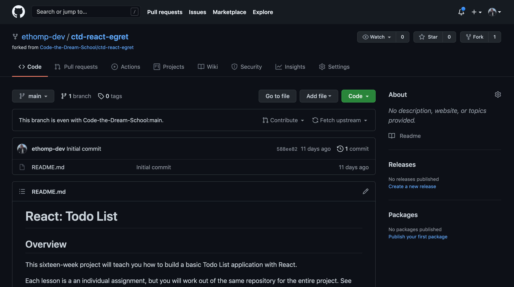
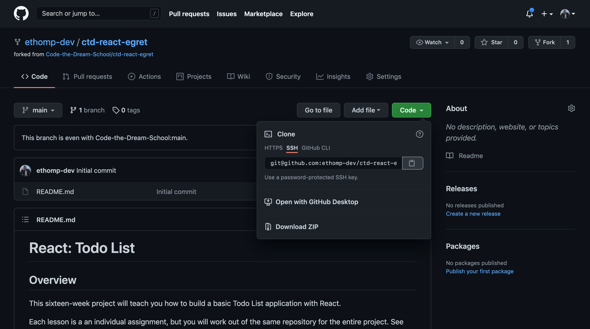
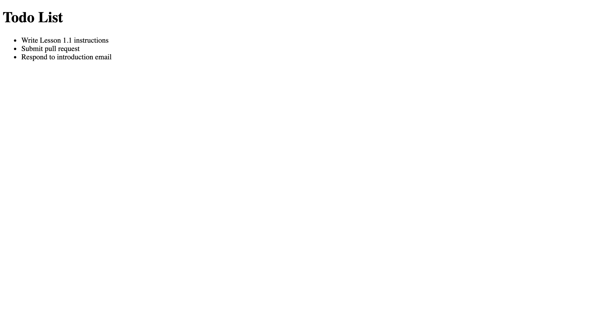

[< Back to Overview](../../README.md)

# Lesson 1.1: Introduction

This assignment will teach you the following:

- Hello React
- Project Setup
- React components
- JSX in React
- Lists in React

---

## Instructions

### Getting Started:

Fork this GitHub repository to create your own working version:

https://github.com/Code-the-Dream-School/ctd-react-egret

After completing the steps, you should be directed to your forked GitHub repository:

Click the "Code" button and copy the URL for your repository:

Clone this repository so that the code is available on your local machine:

> Hint: Run this command from the directory where you want to store your code

> Note: Replace `<url>` with the URL you copied in the previous step

    git clone <url>

Navigate to the directory you just cloned in your terminal:

    cd ctd-react-egret

Create a new local branch to work on separate from the `main` branch:

    git checkout -b lesson-1-1

Now, open the project directory in your code editor and continue to the next section.

### Task List:

#### Project Setup

In your terminal, use the `create-react-app` script to generate a new React project:

> Note: the `.` specifies that the app should be created in the same directory and the `--template` specifies what project template to use

    npx create-react-app . --template minimal

Replace the new auto-generated README with the "old" version:

    mv README.old.md README.md

Install project dependencies (this may take a few minutes):

    yarn

Run the application:

    yarn start

#### React Components and JSX

- [ ] Open the `src/App.js` file
- [ ] Remove the existing JSX from the component
- [ ] Create a level-one heading that says "Todo List"
- [ ] Create an unordered list (`<ul>`)

#### Lists in React

- [ ] Above the `App()` function, create an empty Array and store it in a variable named `todoList`
- [ ] Inside the Array, create at least 3 Objects with the following properties:
    - `id`: unique identifier (ex. `1`, `2`, `3`)
    - `title`: summary of the todo item (ex. `"Complete assignment"`)
- [ ] Inside your unordered list, insert a JavaScript expression
    - hint: `{}`
- [ ] Inside the JavaScript expression, map over your `todoList` array
- [ ] For each Object in the Array, return a list item (`<li>`) with the following:
    - `key` attribute with value of `id` property
    - inner text content with value of `title` property

#### Final Result

### Final Step:

Check the status of your local repository to double-check the changes you made:

    git status

Stage the file(s) that you edited:

    git add .

Check the status again and notice that the changes from before are now staged:

    git status

Create a commit for the changes you made and add a message describing the changes you made:

> Note: Replace `<message>` with your message

    git commit -m "<message>"

Push your commit to the remote repository (visible in GitHub):

    git push

Check the log to make sure your commit has been published:

    git log --oneline

Create a pull request and submit:

[View instructions](https://github.com/Code-the-Dream-School/common-instructions/blob/main/common/how-to-pull-request.md)

---

Created by [Code the Dream](https://www.codethedream.org)
