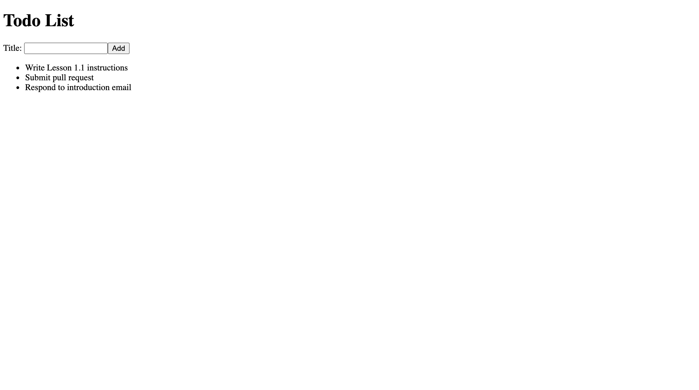

[< Back to Overview](../../README.md)

# Lesson 1.2: React Components

This assignment will teach you the following:

- React DOM
- Component Definition
- Component Instantiation
- React Components

---

## Instructions

### Getting Started:

Merge your pull request from the previous lesson (if you haven't already):

[View tutorial](https://github.com/Code-the-Dream-School/common-instructions/blob/main/common/how-to-merge.md)

Checkout your main branch and pull changes:

    git checkout main
    git pull

Create a new local branch to work on separate from the `main` branch:

    git checkout -b lesson-1-2

Now, open the project directory in your code editor and continue to the next section.

### Task List:

#### Move List into New "Todo List" Component

- [ ] Inside `/src` directory, create a new file called `TodoList.js`
- [ ] Open `/src/TodoList.js`
- [ ] Create a new functional React component (see below)
    - [ ] Import `React` from "react" npm package
    - [ ] Declare a function named `TodoList`
    - [ ] Export `TodoList` function as default module
- [ ] Add a multi-line return statement to your `TodoList` function (this is where we will insert JSX)
    - hint: use parenthesis for multi-line return
- [ ] Move list JSX from `App.js` to `TodoList.js` (see below)
    - [ ] Open `/src/App.js`
    - [ ] Cut (copy and remove) the entire list element (`<ul>`) code
    - [ ] Open `/src/TodoList.js`
    - [ ] Inside the multi-line return, paste the list element (`<ul>`) code
- [ ] Move `todoList` array from `App.js` to `TodoList.js` (see below)
    - [ ] Open `/src/App.js`
    - [ ] Cut (copy and remove) the entire `todoList` variable declaration
    - [ ] Open `/src/TodoList.js`
    - [ ] Below the import, paste the `todoList` variable
- [ ] Refactor `App.js` to use new `TodoList` component (see below)
    - [ ] Open `/src/App.js`
    - [ ] Below `React`, import `TodoList`
    - [ ] Below the level-one heading, use the `TodoList` component
- [ ] Run your application and view in browser
    - [ ] Verify that your Todo List still appears correctly

#### Create "Add Todo Form" Component

- [ ] Inside `/src` directory, create a new file called `AddTodoForm.js`
- [ ] Open `/src/AddTodoForm.js`
- [ ] Create a new functional React component (see below)
    - [ ] Import `React` from "react" npm package
    - [ ] Declare a function named `AddTodoForm`
    - [ ] Export `AddTodoForm` function as default module
- [ ] Add a multi-line return statement to your `AddTodoForm` function (this is where we will insert JSX)
    - hint: use parenthesis for multi-line return
- [ ] Write JSX for "Add Todo" form (see below)
    - [ ] Create a `<form>` element
    - [ ] Inside the `<form>` element, create a `<label>` element with text "Title"
    - [ ] Next, create a text `<input>` element with `id` "todoTitle"
    - [ ] Add `htmlFor` attribute to `<label>` element with same value as `id` above
    - [ ] Next, create a submit `<button>` element with text "Add"
- [ ] Use `AddTodoForm` component in `App.js` (see below)
    - [ ] Open `/src/App.js`
    - [ ] Below `React`, import `AddTodoForm`
    - [ ] Below the level-one heading, use the `AddTodoForm` component
- [ ] Run your application and view in browser
    - [ ] Verify that "Add Todo" form appears below heading

#### Final Result

### Final Step:

Check the status of your local repository to double-check the changes you made:

    git status

Stage the file(s) that you edited:

    git add .

Check the status again and notice that the changes from before are now staged:

    git status

Create a commit for the changes you made and add a message describing the changes you made:

> Note: Replace `<message>` with your message

    git commit -m "<message>"

Push your commit to the remote repository (visible in GitHub):

    git push

Check the log to make sure your commit has been published:

    git log --oneline

Create a pull request and submit:

[View instructions](https://github.com/Code-the-Dream-School/common-instructions/blob/main/common/how-to-pull-request.md)

---

Created by [Code the Dream](https://www.codethedream.org)
